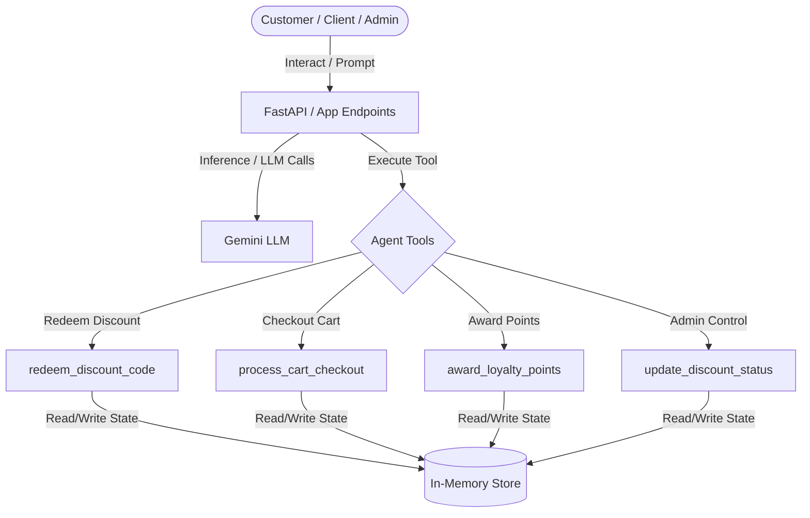
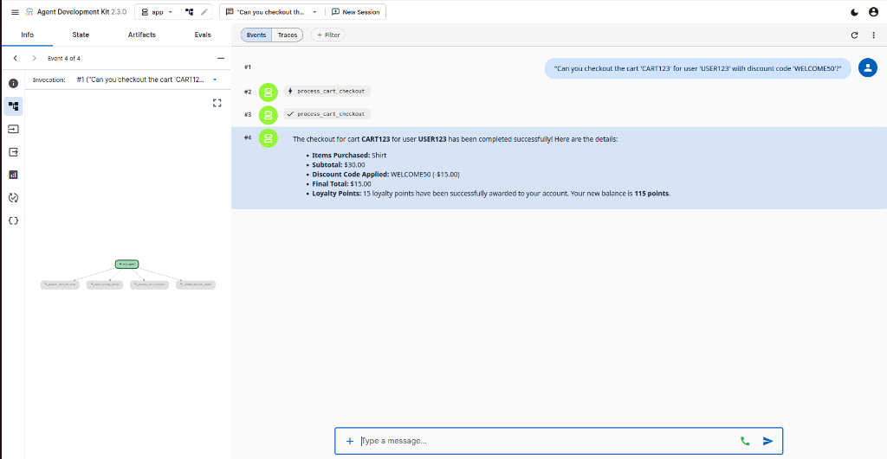

# Kaggle Shopping Assistant

A secure, multi-tool AI Retail Companion built using the Agent Development Kit (ADK 2.0). 

This project was developed as part of the Kaggle 5-Day AI Agents: Intensive Vibe Coding Course With Google.

---

## Overview

Kaggle Shopping Assistant is an intelligent, conversational store agent designed to guide retail customers through checkout, manage coupon promotions, and award loyalty points. 

Beyond customer-facing capabilities, the project serves as a reference implementation for security-first agent design, featuring strict input validation, pre-commit credential gates, and runtime command-filtering hooks.

---

## Core Capabilities & Tools

The agent is equipped with four core tools implemented in app/agent.py:

*   **`process_cart_checkout`**: Checks out active shopping carts, validates ownership, applies discounts, computes final totals, and triggers point rewards.
*   **`redeem_discount_code`**: Redeems single-use discount codes (e.g., `WELCOME50`, `SUMMER20`) while enforcing registration checks and single-use limits.
*   **`award_loyalty_points`**: Automatically adds transaction-based loyalty points to customer accounts.
*   **`update_discount_status`**: Gated administrative tool allowing authorized users to activate or deactivate discount codes dynamically.

---

## Security & Safety Guardrails

This project implements advanced safety mechanisms to secure AI agent interactions and prevent common vulnerabilities:

### 1. Input Gating & Pydantic Validation
All tool parameters are validated against strict Pydantic schemas (such as `ProcessCartCheckoutInput` and `AwardLoyaltyPointsInput`) to prevent prompt injections from passing malformed parameters or exploiting variables.

### 2. PreToolUse Hook (Command Filtering)
Configured in `.agents/hooks.json`, a custom python safety guard `.agents/scripts/validate_tool_call.py` intercepts all `run_command` invocations. It scans for dangerous shell patterns (such as `rm -rf /`, destructive `dd` commands, or filesystem creations) and blocks execution if matches are found.

### 3. Pre-Commit Credential Scanning
Integrated via `.pre-commit-config.yaml` and `.semgrep/rules.yaml`, the repository runs automated local scans on every `git commit`. It automatically flags hardcoded Google API credentials (prefixed with `AIzaSy...`) in source files, forcing secure developer habits.

### 4. STRIDE Threat Model
A complete threat model mapping trust boundaries, threat scenarios, and corresponding remediations is documented in `threat_model.md`.

---

## System Architecture & Data Flow

Below is the conceptual architecture showing trust boundaries and tool dependencies (rendered natively):



---

## Reference Screenshot

### Interactive Shopping Assistant (Playground UI)
*Shows the agent successfully checking out an active cart, applying the `WELCOME50` discount code, and awarding loyalty points.*



---

## Getting Started

### Prerequisites
*   **uv**: Fast Python package manager (https://docs.astral.sh/uv/getting-started/installation/)
*   **agents-cli**: Google Agent CLI tool (`uv tool install google-agents-cli`)

### Setup & Installation
1.  Install dependencies:
    ```bash
    agents-cli install
    ```
2.  Install the pre-commit git hooks:
    ```bash
    uv run pre-commit install
    ```
3.  Set up your Google AI Studio API key in a `.env` file:
    ```env
    GEMINI_API_KEY=your_actual_api_key_here
    ```

### Running Locally
To launch the interactive playground:
```bash
agents-cli playground
```

### Running Tests
To run the full suite of 19 unit and security tests:
```bash
uv run pytest tests/test_agent.py tests/unit/test_agent.py
```
