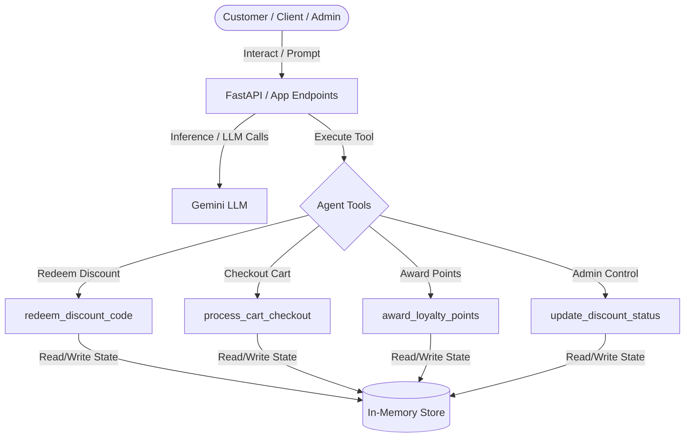

# STRIDE Threat Model Assessment: Shopping Assistant

This document presents a systematic STRIDE threat modeling assessment of the `shopping-assistant` codebase and architecture, covering the customer agent and administrative features.

---

## 1. System Boundaries & Data Flow

### Entry Points
*   **Conversational Interface**: Customers and administrators send natural language prompts through the API endpoints.
*   **FastAPI Endpoints**: Web API exposed via `app/fast_api_app.py`, including the `/feedback` and standard session endpoints.
*   **Tool Executions**:
    *   `redeem_discount_code`: Customer-facing discount redemption.
    *   `process_cart_checkout`: Customer checkout processing (with optional discount application).
    *   `award_loyalty_points`: Utility to award points after checking out.
    *   `update_discount_status`: Admin-restricted activation/deactivation of single-use codes.

### Data Storage & Assets (In-Memory)
*   **Discount Code State (`DISCOUNT_CODES`)**: Store of code details (redemption status, active status, owner).
*   **User Registries (`REGISTERED_USERS`, `ADMIN_USERS`)**: Sets of valid user IDs and authorized administrators.
*   **Loyalty Points (`LOYALTY_POINTS`)**: User point balances.
*   **Shopping Carts (`CARTS`)**: Current customer carts and processing status.
*   **Secrets**: Gemini API connection credentials (supported by a local gitignored `.env` file, and verified by a Semgrep mock credential pre-commit check).

---

## 2. STRIDE Threat Analysis

### 🕵️‍♂️ Spoofing
*   **Threat**: An attacker can claim to be a registered customer (e.g., `USER123`) or an administrator (e.g., `Nataraj-EL`) to perform unauthorized transactions or modifications.
*   **Analysis**: The tools accept `user_id` and `admin_user_id` parameters parsed from conversation inputs. Because there is no cryptographic signature, session token, or OAuth verification tying the client connection to the claimed identity, a user can easily spoof another user's or administrator's ID.
*   **Mitigation**: Implement user authentication (e.g., JWT or OAuth2 tokens) at the FastAPI entry point, and retrieve the `user_id` from the authenticated session context rather than relying on user-provided prompt inputs.

### 📝 Tampering
*   **Threat**: An attacker could tamper with the parameters passed to the checkout, redemption, or loyalty tools, or corrupt the in-memory state.
*   **Analysis**:
    *   **Prompt Injection**: A user could craft a message that tricks the LLM into calling the tool with malicious parameters (e.g., trying to check out another user's cart, award massive points, or deactivate codes).
    *   **State Race Conditions**: The in-memory dictionaries are modified globally. Concurrent requests in a multi-threaded server environment could lead to race conditions (e.g., double redemption or checking out the same cart twice).
*   **Mitigation**:
    *   Validate inputs strictly via the defined Pydantic input schemas (as done in `AwardLoyaltyPointsInput`, `ProcessCartCheckoutInput`, etc.).
    *   Move state storage from in-memory dictionaries to a transactional database (e.g., PostgreSQL or Spanner) with ACID transactions and row-locking to ensure single-use constraints.

### 👤 Repudiation
*   **Threat**: A user claims they did not redeem a code, check out a cart, or authorize a discount status change, and the system has no proof.
*   **Analysis**: The application lacks structured transactional auditing. There is no audit trail recording actions (e.g., timestamp, client IP, authenticated session ID).
*   **Mitigation**: Write structured, immutable audit logs to Cloud Logging or BigQuery every time a state change occurs (e.g., code redemption, checkout success/failure, or status changes), including the verified user identity and timestamp.

### 🔒 Information Disclosure
*   **Threat**: Leaking of sensitive tokens, system logic, or database/state structures.
*   **Analysis**:
    *   **Hardcoded API Key**: The Gemini client is configured with a simulated hardcoded API key in `app/agent.py` (`api_key="AIzaSyD-mock-key-value-12345"`). While used for demo gating, it violates secret management roads if pushed to version control.
    *   **Debug/Trace Leakage**: If the tool encounters unhandled exceptions, raw tracebacks could be returned to the client.
*   **Mitigation**:
    *   Store API keys in GCP Secret Manager or pass them via environment variables rather than hardcoding.
    *   Configure global exception handlers in FastAPI to mask raw traceback logs from the client.

### 🚫 Denial of Service (DoS)
*   **Threat**: A malicious user spams the endpoint, exhausting system resources or causing high API billing.
*   **Analysis**: There are no rate limits configured on the FastAPI application. Since every conversation turn performs expensive LLM calls, an attacker could trigger massive resource usage and API billing.
*   **Mitigation**: Implement rate limiting middleware (e.g., using Redis or FastAPI-limiter) to restrict the number of requests per user/IP.

### 🔑 Elevation of Privilege
*   **Threat**: A regular user calls administrative functions (such as `update_discount_status`) or accesses other users' carts.
*   **Analysis**:
    *   The `update_discount_status` tool validates that `admin_user_id` belongs to `ADMIN_USERS`. However, because this ID is self-reported, privilege elevation is trivial via spoofing.
    *   The `process_cart_checkout` tool checks that the cart's owner matches the provided `user_id`. But since `user_id` is self-reported, a user could check out any cart if they spoof the owner's ID.
*   **Mitigation**: Enforce authentication and role-based access control (RBAC) at the API gateway or endpoint level to ensure only authorized users can initiate sessions and invoke specific endpoints.

---

## 3. Summary of Core Vulnerabilities & Remediations

| Pillar | Vulnerability | Severity | Remediation |
| :--- | :--- | :--- | :--- |
| **Spoofing** | User and Admin identities are self-reported and not verified. | **High** | Bind identities to authenticated session context (JWT/OAuth2). |
| **Tampering** | In-memory state modification is non-transactional and non-thread-safe. | **Medium** | Migrate to a database with transaction management and locking. |
| **Repudiation** | Lack of structured transactional logs for discount redemptions / checkouts. | **Low** | Log all code redemptions and checkouts to an immutable audit log. |
| **Info Disclosure** | Hardcoded simulated API key in `app/agent.py`. | **High** | Move API credentials to environment variables / Secret Manager. |
| **Denial of Service** | No rate limits on conversational API endpoints. | **Medium** | Add rate-limiting middleware to FastAPI. |
| **Elevation of Privilege**| Administrative status relies on self-reported `admin_user_id`. | **High** | Implement endpoint authentication and RBAC. |
